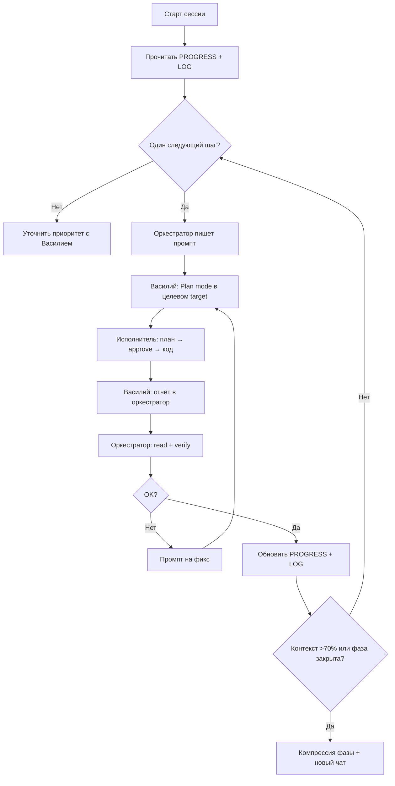

# SNARK — Playbook оркестратора

Руководство для чата-оркестратора (`orchestrator_doc`) и для Василия как оператора.
Cursor rule: [`.cursor/rules/60-orchestrator.mdc`](.cursor/rules/60-orchestrator.mdc).

---

## 1. Роли

| Кто | Где | Делает |
|---|---|---|
| **Оркестратор (AI)** | Чат в `orchestrator_doc` | План, промпты, проверка, `PROGRESS.md` / `LOG.md` / `SPEC.md` |
| **Василий** | Этот чат | Обсуждение, приоритеты, «go», деплой, push |
| **Исполнитель (AI)** | Plan mode в target | Код по промпту оркестратора |
| **Память проекта** | `orchestrator_doc/` | PROGRESS (hot) + LOG + archive |

---

## 2. Карта репозитория

```
../                          ← корень репо (snark-portal)
├── orchestrator_doc/        ← этот workspace (хаб)
├── app/                     ← Next.js 16, :3000
├── services/protocols/      ← snark-protocols, :8000
└── docs/                    ← детальные ТЗ
```

| Target | Путь (от корня репо) | Когда трогать |
|---|---|---|
| **snark-portal** | `..` (родитель `orchestrator_doc`) | UI, API, Drizzle, auth, tasks, chat |
| **snark-protocols** | `../services/protocols` | STT, LLM, Celery, FastAPI |
| **orchestrator_doc** | `.` (этот workspace) | После каждой verified сессии |

**Порядок при зависимостях:** protocols (API) → portal (proxy/UI) → prod deploy.

**Git:** `VasiliiLbyte/v0-project-snark`, ветка `main`.

---

## 3. Алгоритм одной итерации



### Правила силы

1. **Один промпт = одна цель = один target** (`snark-portal` или `snark-protocols`).
2. **Protocols-first:** API протоколов → portal proxy/UI.
3. **Промпт самодостаточен** — исполнитель не помнит прошлый чат.
4. **Plan mode** в исполнителе — план до кода.
5. **Verify before PROGRESS/LOG** — только проверенное.
6. **Не параллелить зависимые задачи** в разных target.
7. **Сессия заканчивается записью в LOG.md** (сверху).

### Verify из этого workspace

```bash
git -C .. status -s && git -C .. diff --stat
cd .. && pnpm typecheck && pnpm test
cd ../services/protocols && ruff check src/
```

---

## 4. Шаблон промпта для исполнителя

```markdown
## SNARK Executor — [ID: YYYY-MM-DD-NN]

**Target:** snark-portal | snark-protocols
**Путь:** `..` (portal) | `../services/protocols` (от корня репо)
**Git:** ветка `main` | `feature/<фаза>`; коммит `type: описание [ID]`; push — по команде оператора
**Связь с платформой:** PROGRESS.md → «Следующее» (описание)

### Цель
Одно предложение.

### Контекст
- Что уже есть.
- SPEC / API_CONTRACT при необходимости.

### Файлы (ожидаемые)
- `path/to/file`

### НЕ трогать
- ...

### Критерии готовности
- [ ] Проверяемый пункт
- [ ] `pnpm typecheck` / `ruff check` чисто

### Проверка
команды verify

### Отчёт оркестратору
- Файлы, вывод проверок, риски, нужен ли DEP
```

**ID промпта** — ссылки в [`LOG.md`](LOG.md).

---

## 5. Старт, конец сессии, компрессия

### Старт (новый чат)

```
Ты — оркестратор SNARK. Прочитай в корне workspace:
- PROGRESS.md
- LOG.md (последняя запись)
- SPEC.md (если меняется логика)
- ORCHESTRATOR.md
Продолжи с «Следующее» в PROGRESS. Не пиши код — готовь промпты для Plan mode.
```

### Компрессия при закрытии фазы

Развёрнутые записи в LOG сжимаются до **2–3 строк** (итог, SHA, точка отката). Детали → [`archive/`](archive/). Hot PROGRESS не раздувается.

### Конец сессии — чеклист

0. [ ] `git add` изменений `orchestrator_doc/` и правил + `commit` (`docs(orchestrator): ... [ID]`) + `push` — push после «go» оператора
1. [ ] PROGRESS актуален (hot ≤150 строк)
2. [ ] LOG.md — новая запись **сверху** (инциденты, откат, verified)
3. [ ] Компрессия закрытой фазы выполнена (если применимо)
4. [ ] Pending deploy актуален (если prod-scope)
5. [ ] SPEC обновлён (только при смене бизнес-логики)

Новый чат — с тем же стартовым промптом.

---

## 6. Naming conventions

| Паттерн | Значение | Пример |
|---------|----------|--------|
| `YYYY-MM-DD-NN` | ID промпта | `2026-07-15-02` |
| `DEP-NNN` | Pending deploy | `DEP-001` |
| `snark-portal` | Target: Next.js | в шапке промпта |
| `snark-protocols` | Target: Python | в шапке промпта |

---

## 7. Plan mode + Auto

Оркестратор (Auto) — планирование, промпты, ревью, docs. Исполнители: Auto для UI/CSS; Sonnet/Opus для auth, миграций, STT/LLM, кросс-файловых рефакторов.

---

## 8. Типичные ошибки

| Ошибка | Как правильно |
|---|---|
| Писать код в оркестраторе | Промпт → Plan mode |
| PROGRESS/LOG до verify | Сначала read/verify |
| Два target в одном промпте | Два промпта по порядку |
| DEP до SYNC-SERVER | Сначала сервер в git |
| Push без «go» | Ждать оператора |

---

## 9. Текущий фокус

См. [`PROGRESS.md`](PROGRESS.md) → «Следующее».

---

*Крупные решения — в LOG.md; карта состояния — archive/.*
